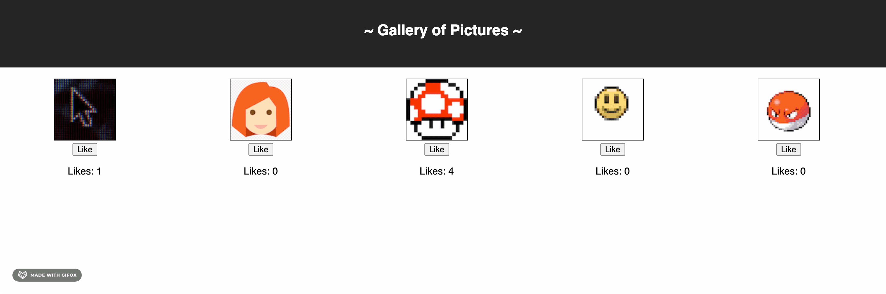

# React Gallery

## Description
_Duration: Weekend_

Through the use of react and node.js, the application displays five images that by click, can toggle between the image and the caption. In making this application, I tested my skills of passing objects and functions as props and linking server code with my react app through axios.

## App

## Prerequisites
- Download Node.js

## Installation
- Open the app in your editor
- Run `npm install` in the terminal
- Run `npm run server` in the terminal. This starts up the server.
- Run `npm run client` in a second terminal. This will direct you to the tab in the browser.

## How To Use
Clicking on the image toggles between the image and its caption. The 'Like' button allows the user to like the image. The amounts of likes display under each image.

## Built With
- React
- Node.js

## Acknowledgment
Thanks to [Prime Digital Academy](https://primeacademy.io/?utm_campaign=brand_search&utm_medium=cpc&utm_source=google&utm_medium=ppc&utm_campaign=Brand+Search&utm_term=prime%20digital&utm_source=adwords&hsa_mt=p&hsa_kw=prime%20digital&hsa_grp=34455376016&hsa_tgt=kwd-18367450681&hsa_ad=260264094213&hsa_ver=3&hsa_acc=5885076177&hsa_cam=670836869&hsa_src=g&hsa_net=adwords&gclid=EAIaIQobChMIn83dj9j46wIVE9bACh1EhQDHEAAYASAAEgIDIvD_BwE) who equipped me with the skills needed to make this application.

## Support
If you have any suggestions or issues, please contact me by email at [ethanmkavanagh@outlook.com](www.google.com).
